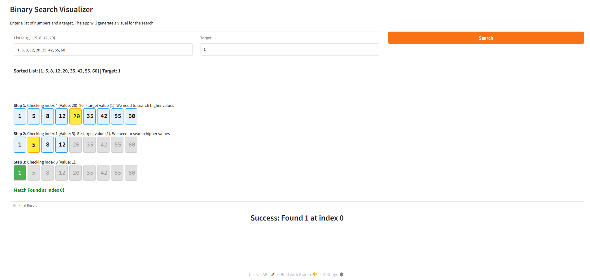

Albert Osei-Wireko

CISC121-002

Binary Search

---
## App Link
https://huggingface.co/spaces/HatterManner/121final

---
## Demo Screenshots

---
## Computational Thinking
I'm doing a binary search because it's a relatively simple algorithm and its interesting to see each step of how it works. It's also a very important algorithm and I think a visualizer really helps understand it.
1. Decomposition:
	1. I need to ensure the user inputs a list of numbers and a target number.
	2. Check if the input is sorted, then sort it if necessary. When an input is sorted, notify the user that, as per the nature of the demo, the sort will not be visualized.
	3. Do the binary search
	4. Return the index of the target, or a message if it doesn't exist.
2. Pattern Recognition
	1. Its a binary search. The process of splitting the list in half and comparing midpoint to target repeats until it is found or shows that the target doesn't exist.
3. Abstraction
	1. I need the user to see:
		1. The input (list of numbers)
		2. The sorted list
		3. Distinctions for low, mid, high (use different colours for each)
		4. The active search range (make inactive items a different colour)
	2. I don’t want the user to see:
	3. The sorting algorithm
4. Algorithm Design
	1. Inputs: numbers (string)
	2. Process: Turn string into a list of ints, sort list, do binary search and update visuals with each step of the search.
	3. Output: Index of target or “not found”.
---
## Testing

| Test Case            | Input List        | Target | Expected Result                              | Pass/Fail |
| :------------------- | :---------------- | :----- | :------------------------------------------- | :-------- |
| **Normal Search**    | `1, 5, 8, 12, 20` | `12`   | Found at index 3                             | Pass      |
| **Not Found**        | `1, 5, 8, 12`     | `99`   | Target not found message                     | Pass      |
| **Edge Case: Start** | `1, 5, 8`         | `1`    | Found at index 0                             | Pass      |
| **Edge Case: End**   | `1, 5, 8`         | `8`    | Found at index 2                             | Pass      |
| **Unsorted Input**   | `20, 1, 5`        | `5`    | Auto-sorts to `1, 5, 20` $\rightarrow$ Found | Pass      |
| **Invalid Input**    | `a, b, c`         | `5`    | Error Message (No crash)                     | Pass      |

---
## How to Use
To run this project:

1.  **Enter a list of numbers**
*The program will sort it automatically*.
2.  **Enter a target number**
*The program will search for this number*.
3.  **Press "Search"**
*The visualizer will show the process to find the target, whether or not it was found, and what index.*

---
## Acknowledgments & References
* **Some of my sources (there were more from the same sites but i didnt document all.):**
    * [W3Schools: CSS Flexbox](https://www.w3schools.com/css/css3_flexbox.asp)
    * [GeeksforGeeks: Introduction to CSS Flexbox](https://www.geeksforgeeks.org/introduction-to-css-flexbox/)**
    * [W3Schools: CSS Box Model](https://www.w3schools.com/css/css_boxmodel.asp)
    * [Stack Overflow: Inline CSS](https://stackoverflow.com/questions/268821/is-it-bad-practice-to-use-inline-css)**
    * [GeeksforGeeks: HTML Div Tag](https://www.geeksforgeeks.org/html-div-tag/)
